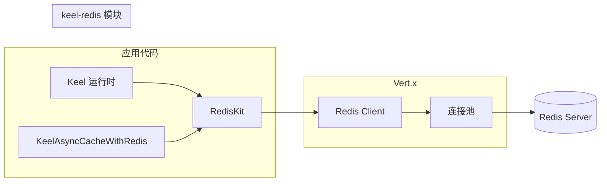

# 架构与依赖视图

## 组件关系

## 调用路径（典型）

1. 应用持有 **`RedisKit`**（单例或按作用域管理）。
2. 业务调用 `RedisKit` 上的 Mixin 方法 → 内部 **`api(redisAPI -> ...)`** 使用池化 `RedisAPI`。
3. 需要单连接语义时走 **`withConnection`** 或 **`withTransaction`**：`Redis.connect()` → 独占连接 → 关闭归还。

## 与 keel-core 的边界

- **配置**：`RedisConfig` 继承 `ConfigElement`。
- **运行时**：`Redis.createClient(Keel, RedisOptions)` 需要 **`Keel`**（Vert.x 上下文由 Keel 管理）。
- **缓存**：`KeelAsyncCacheWithRedis` 仅依赖接口 **`KeelAsyncCacheInterface<String, String>`**，便于在核心层统一抽象。
